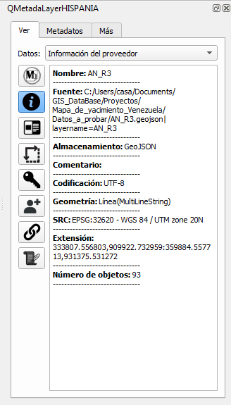
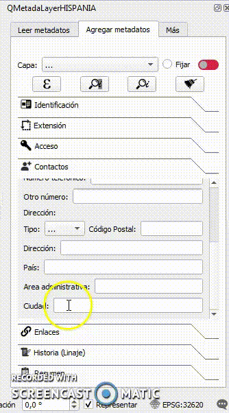
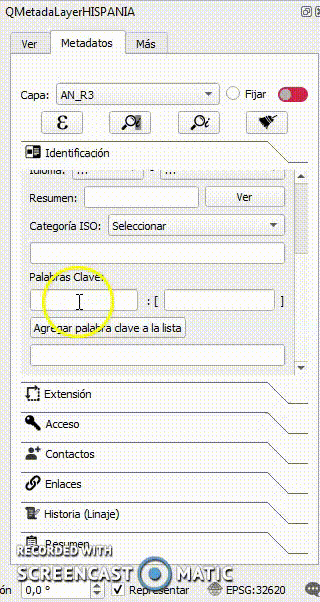
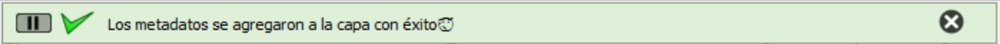
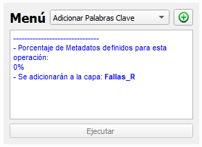
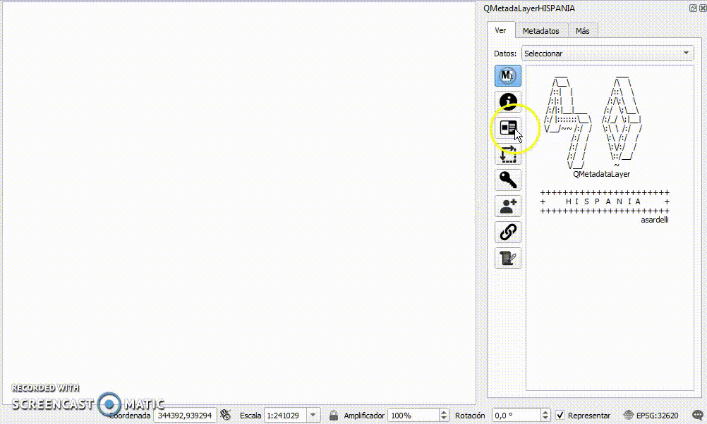

# Complemento QMetadataLayer HISPANIA

Un complemento para QGIS

   

 

## Sobre el Complemento

<i>QMetadaLayer HISPANIA</i> es la versión en español del complemento que permite visualizar, agregar, modificar y manipular, así como cargar, guardar, abrir, editar desde y en un archivo los metadatos asociados a una capa en QGIS, tanto vectoriales como raster a través de una interfaz sencilla y dinámica que facilita la visualización de cualquier capa, así como añadir información de una manera más rápida y confiable bajo estándares internacionales (ISO, INSPIRE) asegurando mantener la uniformidad de los datos. El complemento, además, cuenta con sugerencia en ítems claves, en algunos casos con información de países hispanoamericanos y España.

## Lenguaje

 Los códigos de QMetadataLayer está escrito en lenguaje Python, las ventanas fueron creadas en Qt5.

## Desarrollador

QMetadataLayer fue realizado por <b>Aldo Sardelli</b> <asardelli@gmail.com> geólogo con experiencia en la industria de O&G, con una maestria en Caracterización y Explotación de Yacimientos, apasionado del mundo GIS especialmente del software QGIS, asi como del lenguaje de programación Python.

### Redes:

- <b>LinkdIn:</b> <i>www.linkedin.com/in/geol-aldo-sardelli</i>
- <b>GitHub:</b>  <i>github.com/asardelli</i>
- <b>Twitter X:</b> <i>asardelli</i>
- <b>Mastodon:</b> <i>@asardelli@fosstodon.org</i>

## Instalación

### Servidor de QGIS

En el menú <i>Complemento</i> se selecciona la opción <i>Administrar e instalar complementos...</i>, seguido se desplega una ventana <b>"Complementos"</b>

   

 

Se escribe el nombre del complemento en la parte superior, se selecciona y se hace click en el botón <b> Instalar complemento</b>

<b><i>¡Listo! El complemento se ha instalado</i></b>

### Instalador ZIP

La instalación a través de una carpeta zip que se puede descargar [aquí](https://github.com/asardelli/QMetadataLayerHISPANIAdownland.git). Para proceder con la instalación se selecciona la opción <i>Administrar e instalar complementos...</i> en el menú <i>Complemento</i>, seguido se desplega una ventana <b>"Complementos"</b>

Se selecciona Instalar a partir de ZIP.

   

  

Se busca la carpeta comprimida QMetadataLayer.zip

Seleccionado el archivo instalador se activa el botón <b>Instalar complemento</b>.

Se hace clic y aparece un mensaje <i>La instalación de un complemento de una fuente no confiable puede dañar su computadora. Continúe solo si recibió el complemento de una fuente confiable. ¿Continuar?.</i>

  

Clic sobre el botón <b>Si</b>.

<b><i>¡Listo! El complemento se ha instalado</i></b>

## Acciones e innovaciones

<i>QMetadaLayer HISPANIA</i> cuenta con una serie de acciones que mejorarán tu experiencia:<b> Visualización</b> de información del proveedor  y metadatos de una manera estructurada, de fácil acceso y dinámica (visualizar la información de cualquier capa solo con seleccionarla), contará con <b> Novedades</b> como: el uso de <u>Variables</u> con información especifica útil para definir los metadatos, sistema de <u>completación de palabras</u> con información estandarizada, <u>validación de código postal</u> (solo para Venezuela), listas con <u>información estandarizada</u> que permite la rápida definición a través de una simple selección, <u>usar</u> los metadatos existentes en la capa seleccionada u otra capa, todas las opciones para <b>agregar, editar y remover</b> información por medio de una interfaz sencilla y dinámica, <b>cargar</b> metadatos desde un archivo QMD y <b>guardar, visualizar, editar</b> los metadatos en un archivo QMD.

##  Visualización

La pestaña "Ver" del complemento <i>QMetadaLayer HISPANIA</i> esta dispuesta para la visualización de toda la información de cabecera o de descripción generada al momento de cargar la capa y de los metadatos asociados a la capa.

Para acceder a la información puede hacerse desde la lista en la parte superior o directamente haciendo clic en los botones dispuestos en la parte lateral derecha (Ver figura).

  

  

La primera información a la que se puede acceder es la <b>información de Proveedor</b>, que representa la información de cabecera  o de descripción generada al momento de cargar la capa, los cuales son: <i>Nombre de la capa, Fuente, Almacenamiento, Comentario, Codificación, Geometría, SRC, Extensión y Número de objetos</i> (ver figura)

  

  

En orden descendente se puede ir accediendo a la información de los metadatos, estructurados  de la siguiente manera:

- <b>Identificación</b> <i>(Identificador, Identificador Origen, Título, Tipo, Idioma, Resumen, Categorías y Palabras Clave).</i>
- <b>Extensión</b> <i>(Extensión Espacial: CRS, X Mínimo, Y Mínimo, X Maxímo, Y Maxímo, Z Maxímo, Z Mínimo; Extensión Temporal: Desde, Hasta).</i>
- <b>Acceso</b> <i>(Cuota, Licencias, Derechos y Restricciones).</i>
- <b>Contactos</b> <i>(Contacto: Nombre, Rol, Organizaciónl, Posición, Correo Electrónico, Número Telefónico, Otro Número; Dirección: Tipo de dirección, Código Postal, Dirección, País, Área Administrativa, Ciudad).</i>
- <b>Enlaces</b> <i>(Nombre, Tipo, URL, Descripción, Formato, MIME y Tamaño).</i>
- <b>Historias.</b>

 En la parte inferior, después de los datos, en cada sección aparecerá el nombre de la capa visualizada (ver figura).

  

  

Como se explicó anteriormente, la visualización es dinámica, se puede ir accediendo a la misma información de una sección en diferentes capas (ver figura).

  

  

## Novedades

### Variables

Al definir variables al inicio del proyecto con datos propios del usuario (contacto, dirección y país en abreviación con código de dos letras) así como, dos variables internas del programa como lo es: el sistema de referencia de coordenadas (<i>capa.crs()</i>) y la fuente de la capa seleccionada (<i>capa.source()</i>). Todas permitirán al usuario rellenar algunos ítems de manera rápida. En total el complemento utiliza 17 variables que permite definir 16 ítems con solo apretar el botón "Leer Variables" en cada sección donde se encuentran los ítems.

Las variables globales a definir son 15 y llevan una estructura específica para ser reconocidas por el complemento, las cuales se muestran a continuación:

| <b>Nombre</b> | <b>Variable</b> | <b>Ejemplo</b> |
| :--- | :--- | :--- |
| Nombre del Contacto | <i>contact_name</i> | Aldo Sardelli |
| Rol | <i>contact_rol</i> | custodian |
| Nombre de la Organización | <i>contact_organitation</i> | ACME |
| Posición | <i>contact_position</i> | Geólogo |
| Dirección de Correo Electrónico | <i>contact_email</i> | asardelli@gmail.com |
| Número telefónico | <i>contact_phone1</i> | +582122111222 |
| Otro Número Telefónico | <i>contact_phone2</i> | +582122122111 |
| Tipo de Dirección (Postal o Virtual)| <i>address_type</i> | Postal |
| Código Postal | <i>address_postalCode</i> | 1030 |
| Dirección | <i>address_address</i> | Av Libertador, Edificio La Mar, Piso 1, Oficina 1 |
| Ciudad | <i>address_city</i> | Caracas |
| Área Administrativa | <i>address_administrativeArea</i> | Distrito Capital |
| País | <i>address_country</i> | Venezuela |
| País (abreviación 3 letras) | <i>user_country(COU)</i> | VEN |
| Idioma (abreviación 3 letras) | <i>user_language(lan)</i> | spa |

> <b>Importante</b> este procedimiento se realiza una sola vez, pudiendo modificar las variables cuando sea requerido.

El primer paso es definir las variables siguiendo el procedimiento descrito a continuación:

En el menú <i>Configuración</i>, <i>Opciones</i> se hace clic y aparece la ventana de <b>Opciones</b>.

  

  

Se hace clic en el símbolo más (+) en color verde ubicado en la parte inferior derecha.

  

  

Al hacer clic, se agrega una nueva variable a la que se le asigna el nombre <i>contact_name</i> y como valor por ejemplo <b>Aldo Sardelli</b>. Así se repite la operación para las demás variables.

Una vez cargadas todas las variables la ventana debería quedar de la siguiente manera.

  

  

<b><i>¡Listo! Las Variables han sido cargadas</i></b>

Para hacer uso solo es necesario hacer clic en el botón "Leer Variables" que presenta el siguiente icono:

  

  

Se hace clic en cada sección donde hay items relacionados con las variables (Identificación, Extension y Contacto), como se muestra a continuación:

  

  

### Auto-completación de Palabras

En algunos ítems específicos es posible completar la palabra con escribir la o las primeras letras, esto ayuda a rellenar el ítem y sobre todo a manterner los formatos idóneos para cargar los metadatos.

Bajo este sistema se pueden construir palabras en los ítems:

| Item | Sección |
| :---: | :---: |
|Tipo de Datos | Identificiación |
| Palabra Clave-Concepto | Identificiación |
| Derechos (atribución o Copyright)) | Acceso |
| País* | Contacto |
| Área administrativa** |  Contacto |
| Ciudad*** |  Contacto |

    * Nombre de paises en español.
    ** Estados/Regiones/Departamentos/Provincias/Comunidad de los paises: Argentina, Bolivia, Chile, Colombia, Costa Rica, Ecuador, El Salvador, Guatemala, Honduras, México, Panamá, Paraguay, Perú, Uruguay, Venezuela y España.
    *** Poblaciones solo de Venezuela.

A continuación un ejemplo de como funciona la completación de palabra en este paso para el ítem "País".

  

 

###  Validación de Código Postal

Otra de las novedades con que cuenta el complemento es con la validación del Código Postal según la ciudad, en la versión original funciona solo con ciudades de Venezuela, para adaptarlo a un país específico se debe preparar un archivo y reemplazarlo en el directorio.

El Código puede escribirse o no, al seleccionar la ciudad se rellenará el ítem con su correspondiente información, como se muestra a continuación:

  

  

### Información estandarizada

Existen algunos ítems que cuenta con listas con datos preestablecidos, para facilitar su incorporación y a la vez mantener los estándares. A continuación se muestran estas listas con el ítem al que se encuentran asociado.

#### Idioma

Una lista con 185 abreviaciones de idiomas en todo el mundo, ejemplo <b>"spa"</b> <i>Español</i>. Para más información, visite http://utils.mucattu.com/iso_639-2.html

#### País

Una lista con 249 países, dependencias o Estados en abreviatura de 3 letras, ejemplo <b>"VEN"</b> <i>Venezuela</i>. Para más información, visite https://www.iban.com/country-codes

#### Categorías

Las categorías es otra de la información estandarizada con las establecidas por las normas ISO y a las cuales se adicionaron las establecidas en la directriz ISPIRE de la Unión Europea, adicionalmente se establecieron otras generales y con temas relacionados a la industria de Oil & Gas. El usuario puede agregar manualmente en los metadatos de la capa categorías de uso específico y que no estén en el listado establecido, así como, editar alguna de estas. A continuación se muestra la lista de categorías ISO, Inspire y las adicionales:

| Categorías ISO | Categorías INSPIRE | Categorías Adicionales |
| :--- | :--- | :--- |
| Agricultura | Administración Pública y Gobierno | Distribución |
| Aguas interiores | Aspectos geográficos de carácter meteorológico* | Exploración y prospección |
| Biota | Condiciones atmosféricas* | Información Oil & Gas |
| Climatología, meteorología y atmósfera. | Cuadrículas geográficas | Ingeniería |
| Cobertura de la Tierra con mapas básicos e imágenes | Cubierta terrestre | Instalaciones en Superficie |
| Economía | Direcciones | Modelo de Yacimientos |
| Elevación | Distribución de la población y demografía | Núcleos y Muestras |
| Estructura | Distribución de las especies | Oportunidad exploratoria |
| Información geocientífica | Edificios | Perforación |
| Inteligencia y militar | Elevación** | Planificación Presupuesto Gestion |
| Límites | Energía | Pozo |
| Localización | Geología | Producción |
| Medio ambiente | Hábitats y biotopos | Proyectos pilotos |
| Océanos | Hidrografía | Recuperación Mejorada de Hidrocarburos |
| Planeamiento catastral | Instalaciones de control del medioambiente | Refinación |
| Redes de suministro | Instalaciones de la agricultura y la acuicultura | Seguridad  Higiene Ambiente |
| Salud**** | Instalaciones industriales y de producción | Well Log |
| Sociedad | Justicia y Lenguaje | Yacimientos |
| Transporte | Lugares protegidos | Geología***** |
|  | Nombres geográficos | Movilidad |
|  | Ortoimágenes |  |
|  | Parcelas catastrales |  |
|  | Pérdida Climática |  |
|  | Rasgos geográficos oceanográficos |  |
|  | Recursos energéticos |  |
|  | Recursos minerales |  |
|  | Redes de transporte*** |  |
|  | Regiones biogeográficas |  |
|  | Regiones marinas |  |
|  | Salud y seguridad humanas |  |
|  | Servicios de utilidad pública y estatales |  |
|  | Sistemas de coordenadas de referencia |  |
|  | Suelo |  |
|  | Unidades administrativas |  |
|  | Unidades estadísticas |  |
|  | Uso del suelo |  |
|  | Zonas de riesgos naturales |  |
|  | Zonas sujetas a ordenación / a restricciones / reglamentaciones y unidades de notificación |  |
| <b>****</b> <i>contenido en Salud y seguridad humanas</i> |<b>*</b> <i>contenido en Climatología, meteorología y atmósfera</i> |<b>*****</b> <i>contenido en Geología</i> |
|  |<b>**</b> <i>contenido en Elevación</i> |
|  |<b>***</b> <i>contenido en Transporte</i> |

<u>Procedimiento:</u> Para acceder a las categorias, solo se debe selección entre el listado presentado en el ítem "Categoría ISO" y al seleccionar automáticamente aparecerá en la parte inferior. Se puede escoger más de una categoría e incluso escribir tus propias categorías, solo debes separar una de otra con una coma (,) para que el complemento pueda reconocer que es más de un tema el que deseas agregar. A continuación se muestra como se realiza la selección de categorías.

  

  

#### Licencias

Se listaron las licencias [Creative Commons](https://creativecommons.org/licenses/list.es)  y [Open Data Commons](https://opendatacommons.org/licenses/), pero el usuario puede definir manualmente la licencia que se ajusta a los datos que está registrando.

| Licencia | Listado |
| :--- | :--- |
| Creative Commons CC Zero | CC Zer |
| Creative Commons CC BY | CC BY |
| Creative Commons CC BY-NC | CC BY-NC |
| Creative Commons CC BY-NC-SA | CC BY-NC-SA |
| Creative Commons Attribution 4.0 | CC Attribution 4.0 |
| Creative Commons Attribution CC BY-SA 4.0 | CC BY-SA 4.0 |
| Open Data Commons Public Domain Dedication and Licence | Public Domain Dedication and Licence |
| Open Data Commons Attribution License | Attribution License |
| Open Data Commons Open Database License | Open Database License |

<u>Procedimiento:</u> para agregar una licencia se debe escoger entre el listado propuesto, al seleccionar una el botón "Agregar" que se encuentra al lado del listado cambiará su color a azul, se debe presionar para incluirla y al hacerlo la licencia aparecerá en la parte inferior. Si se desea agregar otra licencia, se repite el procedimiento antes descrito. También, se pueden agregar manualmente la licencia, si es más de una, se debe separar por una coma (,)  para que el complemento reconozco que es más de una la que se desea agregar.

  

  

#### Rol

Se establecieron roles relacionados con la autoría, propiedad y administración de los datos. Se presentan en el idioma Inglés como uso preestablecido en algunas aplicaciones de interoperabilidad, sin embargo, el usuario tiene la posibilidad de escribir manualmente para los metadatos de la capa el rol o editar los ya establecidos. A continuación se muestran los roles y su traducción al Español.

| Nombre del Rol | Código | Descripción |
| :--- | :--- | :--- |
| Autor | author | Parte autora del recurso. |
| Coautor | coAuthor | Parte que, junto con otros, es autora del recurso. |
| Colaborador | collaborator | Parte que ayuda a la creación del recurso y que no es el investigador principal. |
| Contribuidor | contributor | Parte que contribuye al recurso. |
| Conservador | custodian | Parte que acepta la responsabilidad de los datos y asegura un cuidado apropiado y el mantenimiento del recurso. |
| Distributor | distribuidor | Parte que distribuye el recurso. |
| Editor | editor | Parte que revisa o modifica el recurso para mejorar su contenido. |
| Financiador | funder | Parte que proporciona apoyo monetario para el recurso. |
| Mediador | mediator | Clase de entidad que media en el acceso al recurso y para quién el recurso está dirigido es útil. |
| Creador | originator | Parte que ha creado el recurso. |
| Propietario | owner | Parte que es dueña del recurso. |
| Punto de contacto | pointOfContact | Parte con el que se pude contactar para informarse o adquirir el recurso. |
| Investigador principal | principalInvestigator | Parte clave responsable de recopilar información y dirigir la investigación. |
| Procesador | processor | Parte que ha procesado los datos de tal modo que ha modificado el recurso. |
| Publicador | publisher | Parte que publica el recurso. |
| Proveedor del recurso | resourceProvider | Parte que suministra el recurso. |
| Titular de derechos | rightsHolder | Parte que tiene o gestiona derechos sobre el recurso. |
| Patrocinador | sponsor | Parte que patrocina al recurso. |
| Interesado | stakeholder | Parte que tiene un interés en el recurso o en su uso. |
| Usuario | user | Parte que usa el recurso. |

<u>Procedimiento:</u> para agregar un rol de la lista propuesta solo debes seleccionarlo y aparecerá en el espacio a la izquierda del mismo. Solo se permite un rol por contacto, por lo que de escoger otro, este reemplazar al existente. Si el rol que deseas asignar no aparece, lo puedes agregar manualmente, para ello, solo debe escribir en el espacio asignado para ello.

  

  

#### Tipo de dirección

Los tipos de dirección preestablecidos para un contacto son <b>Postal</b> para una dirección física y <b>Virtual</b> para direcciones en la red o computacionales.

<u>Procedimiento:</u> El complemento permite solo seleccionar entre las opciones "Postal" y "Virtual". A continuación se muestra como se debe realizar la selección.

  

  

#### Tipo de Enlace

Se preestablecieron los tipos de enlaces dispuestos por QGIS y que dependen de los diferentes estándares de la información a transmitir.

| Tipo Link | Tipo Link (continuación) | Tipo Link (continuación) |
| :--- | :--- | :--- |
| OGC:CSW | ESRI:ArcIMS | information |
| OGC:SOS | ESRI:ArcGIS | template |
| OGC:SPS | ESRI:MPK | download |
| OGC:SAS | OPeNDAP:OPeNDAP | service |
| OGC:WNS | OPeNDAP:Hyrax | order |
| OGC:WCS | UNIDATA:NCSS | search |
| OGC:WFS | UNIDATA:CDM | esip:CollectionCast |
| OGC:WMS | UNIDATA:CdmRemote | tilejson:2.0.0 |
| OGC:WMS-C | UNIDATA:CdmrfEATURE | iris:fdsnws-event |
| OGC:WMTS | UNIDATA:THREDDS | QuakeML1.2 |
| OGC:WPS | WWW:LINK | file |
| OGC:ODS | WWW:WSDL | http |
| OGC:OGS | WWW:SPARQL:1.1 | https |
| OGC:OUS | OpenSearch1.1 | ftp |
| OGC:OPS | OpenSearch1.1:Description | IETF:GeoJSON |
| OGC:ORS | ISO 195:2003/19139 | GIT |
| OGC:CT | ISO-USGIN | OKFN:datapackage |
| OGC:WFS-G | google:protocol-buffers | boundless:geogig |
| OGC:OWC | google:fusion-tables | OASIS:OData:4.0 |
| OGC:GPKG | ERDDAP:griddap | maxogden:dat |
| OGC:IoT | ERDDAP:tabledap | geoserver:rest |
| OGC:GML | OASIS:AMQP | NOAA:LAS |
|  |  | OSM |

<u>Procedimiento:</u> Para seleccionar el tipo de enlace, solo se debe escoger uno de la lista con 67 tipos. A continuación se muestra como es la selección.

  

  

### Usar Metadatos existentes

Otra de las novedades del complemento y que representan una gran ayuda a la hora de definir y mantener la heterogeneidad de la información común entre capas, es poder leer los metadatos existentes en la capa seleccionada o en otra capa en particular y rellenar los ítems correspondientes. Esta información se puede editar y borrar dependiendo 
de las necesidades en cada ítem.

En ambos casos se puede traer toda la información de metadatos y se realiza de manera independiente en cada sección del formulario en la pestaña 2.

<u>Procedimiento:</u>

#### Metadatos existentes en la misma capa

Para acceder a la información de los metadatos de la capa activa, solo se debe presionar el botón en la parte superior "Leer metadatos de la capa seleccionada" que presenta el siguiente icono,

  

 

La información se accede por cada sección en el formulario, para ello debes posicionarte sobre una de ellas, ejemplo "Identificación" y luego dar clic al botón, como se muestra a continuación:

  

  

Hay casos en que existe más de una información para cada sección de los metadatos, es decir, más de una dirección por contacto, más de un contacto o más de un enlace (link) asociados. Para ello, <i>QMetadataLayerHIPANIA</i> cuenta con mecanismos versátiles que permiten al usuario elegir de una manera clara, rápida y sencilla la información deseada.

<u>Caso: el contacto tiene más de una dirección</u>

Cuando un contacto tiene más de una dirección, el sistema solicitará, a través de una ventana emergente con la lista de direcciones (ver figura), elegir una. Si la ventana ha sido desplegada y se hace clic en el botón "Cancelar", se agregará la primera dirección en la lista.

  

 

A continuación se muestra el procedimiento cuando existen más de una dirección para un contacto.

  

  

<u>Caso: Existe más de un contacto</u>

Los metadatos puede tener registrado más de un contacto, por tanto, el sistema solicitará, a través de una ventana emergente con la lista de contactos registrados (ver figura), que se elija uno. Si la ventana ha sido desplegada y se hace clic en el botón "Cancelar", se agregará el primer contacto en la lista.

  

 

A continuación se muestra el procedimiento cuando existen más de un contacto.

  

  

<u>Caso: Existe más de un contacto con más de una dirección</u>

Si existe más de un contacto y el seleccionado presenta más de una dirección, el sistema realizará las consultas de elección: primero del contacto y dependiendo si este presenta múltiples direcciones, solicitará elegir una dirección. Los procedimientos de selección son iguales a los descritos en los casos anteriores. A continuación se muestra el procedimiento de selección.

  

  

<u>Caso: Existe más de un Link asociado al metadato</u>

Los metadatos puede tener más de un enlace asociado, en este caso, el sistema solicitará a través de una ventana emergente con una lista de los enlaces presente (ver figura) elegir uno. Si la ventana ha sido desplegada y se hace clic en el botón "Cancelar", se agregará el primer enlace en la lista.

  

 

A continuación se hace una demostración de la utilización de este módulo.

  

  

#### Metadatos existentes en otra capa

Para acceder a la información de los metadatos de otra capa, solo se debe presionar el botón en la parte superior "Leer metadatos de otra capa" que presenta el siguiente icono.

  

 

La información se accede por cada sección, para ello debes posicionarte sobre una de ellas, ejemplo Identificación y luego dar clic al botón, inmediatamente se abre una ventana emergente (Ver figura) solicitando la capa de donde se extraerán los datos.

  

 

La cantidad de capas en la lista es la misma cantidad de capas cargadas en el proyecto y que están visibles en el árbol de "Capas"(ver figura).

  

  

A continuación una demostración de como extraer los datos de una capa específica.

  

  

<u>Caso: el contacto tiene más de una dirección</u>

Cuando el contacto de los metadatos que se extraen tiene más de una dirección, se elige la dirección deseada a través del procedimiento descrito para <b>Metadatos existentes en la misma capa</b> [aquí](#id1)

<u>Caso: Existe más de un contacto</u>

Si en los metadatos a extraer existe más de un contacto, se sigue el mismo procedimiento descrito para el caso en  <b>Metadatos existentes en la misma capa</b> [aquí](#id2)

<u>Caso: Existe más de un contacto con más de una dirección</u>

Cuando hay más de un contacto y ese contacto presenta más de una dirección, se procede de la  misma forma para el mismo caso en <b>Metadatos existentes en la misma capa</b> [aquí](#id3)

<u>Caso: Existe más de un Link asociado al metadato</u>

Si el caso es de más de un enlace, se sigue el mismo procedimiento descrito para el caso en <b>Metadatos existentes en la misma capa</b> [aquí](#id4)

### Limpiar formulario

A través de esta opción es posible borrar toda la información en cada sección. Para ello, solo se debe hacer clic en el botón "Limpiar formulario." Con el siguiente icono.

  

 

A continuación se muestra el procedimiento para limpiar una sección.

  

  

## Rellenar el formulario de metadatos

Los metadatos en QGIS se dividen en seis secciones agrupando datos relacionados, de esta misma forma el complemento QMetadataLayerHISPANIA en la pestaña de "Metadatos" divide el formulario en las mismas seis secciones distribuidas en pestañas para una mejor accesibilidad.

### 1.- Identificación:

  

 

En esta sección se completan los datos relacionados con la identificación del recursos:

<i>- Identificador:</i> Una referencia, URI, URL o algún otro mecanismo para identificar el recurso. FORMATO: Cadena de caracteres.

<i>- Identificador Origen o Padre:</i> Una referencia, URI, URL o algún otro mecanismo para identificar el recurso padre del que este recurso es parte (hijo). FORMATO: Cadena de caracteres.

<i>- Título:</i> Devuelve el nombre de recurso legible por humanos, típicamente mostrado en los resultados de las busquedas. FORMATO: Cadena de caracteres.

<i>- Tipo de Datos:</i> Si bien no se obliga a usar un vocabulario formal, se recomienda usar los valores ISO 19115 MD_ScopeCode. Por ejemplo, "dataset" o "series". Si no está seguro del tipo a seleccionar, use "dataset". Cuenta con auto-completación de palabras, para mayor detalle del proceso puede consultar en "Novedades/Auto-completación de Palabras" [aquí](#id10). FORMATO: Cadena de caracteres.

<i>- Idioma:</i> Normalmente, la cadena devuelta seguirá o bien las especificaciones ISO 19115 MD_ScopeCode o la ISO 3166. Sin embargo, esto no es un requisito estricto y el llamador debe tener en cuenta valores que no cumplan estas especificaciones. El complemento QMetadataLayerHISPANIA agrega una composición de abreviaciones de "IDIOMA" y "UBICACIÓN GEOGRÁFICA"(País), ejemplo <u>spa-VEN</u>.

    Idioma: en que se encuentra el recurso. Código de idioma (3 letras). Ejemplo "spa". FORMATO: Cadena de caracteres/Abreviación.

    País: donde se originó el recurso. Código de país (3 letras). Ejemplo "VEN". FORMATO: Cadena de caracteres/Abreviación.

<i>- Resumen:</i> Descripción de forma libre del recurso.FORMATO: Cadena de caracteres.

Como el espacio donde escribir el corto, lo que impide la visualización completa del resumen, QMetadaLayerHISPANIA cuenta con un visualizador emergente, solo presionando el botón "Ver" ubicado al lado, como se muestra a continuación.

  

  

<i>- Categoría ISO:</i> Uno o más temas que de manera general identifica al recurso. Las categorías elegidas se añadirán como una nueva entrada de palabras clave. Los detalles y el procedimiento para agregar categorías están descritos en "Novedades/Información estandarizada/Categorías" [aquí](#id5). FORMATO: Cadena de caracteres, Lista.

<i>- Palabras Clave:</i> Un conjunto de palabras claves descriptivas asociadas con el recurso para un concepto especificado, es decir, ítems asociados a un concepto. Cuenta con auto-completación de palabras en "Concepto", para mayor detalle del proceso puede consultar en "Novedades/Auto-completación de Palabras" [aquí](#id10). FORMATO: Cadena de caracteres, Lista.

    Concepto: Concepto general que engloba palabras claves asociadas al recurso. FORMATO: Cadena de caracteres.

    Ítems: asociados al concepto, separados por comas. FORMATO: Cadena de caracteres.

Para agregar palabras claves, se define el concepto y el o los ítems asociados, luego de hace clic en el botón "Agregar palabra clave a la lista" que cambiara su color a azul cuando el Concepto y los Ítems estén definidos. Se puede agregar tantas palabras claves como sean requeridas, para ello, se debe repetir el proceso anteriormente descrito.

  

  

De igual forma, es posible construir la lista de palabras claves escribiendo en el espacio del formulario dispuesto, para ello, solo se debe tener en consideración la estructura de la lista: <b>'concepto1':['ítem1-1','ítem1-2','ítem1-n'];'concepto2':['ítem2-1','ítem2-2','ítem2-n']</b>. Ejemplo: <u>'formation':['Oficina', ' Merecure']</u>. Importante que el concepto y los ítems estén entre comillas simples (') y las palabras clave separadas por punto y coma (;). FORMATO: Cadena de caracteres.

### 2.- Extensión:

  

 

<i>- CRS:</i> El sistema de referencia de coordenadas descrito por los metadatos de la capa. Solo requiere de la codificación que identifica el SRC, ejemplo: <u>EPSG:32620</u> FORMATO: Código.

<i>- Extensión Espacial:</i> Compuesto por las coordenadas XY máximas y mínimas del espacio donde se suscribe el recurso, así como los valores Z máximos y mínimos.

    Coordenadas XY: Los valores de las coordenadas máximas y mínimas se pueden escribir una a una en los espacios señalados para ello, adicionalmente QMetadataLayerHISPANIA permite calcular a partir de cualquier capa cargada en el proyecto, incluyendo la capa de interés. Para ello solo se debe seleccionar la capa y presionar el botón "<--Calcular" ubicado al lado que será de color azul cuando una capa esté seleccionada. El sistema inicialmente muestra la capa de interés, pero para elegir otra, se debe desplegar la lista y tocarla. Ver demostración. FORMATO: Cadena de caracteres numéricos.

  

  

    Valores Z: los valores Z pueden establecerse manualmente escribiendo en el espacio indicado para ellos, adicionalmente QMetadataLayerHISPANIA permite determinarlos a partir de la capa, para ello, se debe seleccionar el campo que contiene el atributo Z y presionar el botón "Calcular Z" como se muestra a continuación. FORMATO: Cadena de caracteres numéricos.

  

  

<i>- Extensión Temporal:</i> define el período de tiempo cubierto por el contenido del recurso. Comprende las fechas de inicio y fin. Para establecerlo se debe elegir una fecha en el calendario del formato, en la siguiente imagen se muestra el procedimiento. FORMATO: Fecha dd/mm/YYYY hh:mm.

  

  

### 3.- Acceso:

  

 

<i>- Cuotas:</i> Cualquier tarifa asociada al uso del recurso.  Cuenta con auto-completación de palabras, para mayor detalle del proceso puede consultar en "Novedades/Auto-completación de Palabras" [aquí](#id10). FORMATO: Cadena de caracteres.

<i>- Licencias:</i> Una lista de licencias asociadas al recurso. Los detalles y el procedimiento para agregar licencias están descritos en "Novedades/Información estandarizada/Licencias" [aquí](#id6). FORMATO: Cadena de caracteres.

<i>- Derechos (atribución o Copyright):</i> una lista de cadenas de atribución o derechos de copia asociadas al recurso. Listar separado por comas. Cuenta con auto-completación de palabras, para mayor detalle del proceso puede consultar en "Novedades/Auto-completación de Palabras" [aquí](#id10) FORMATO: Cadena de caracteres.

<i>- Restricciones:</i> contiene información concerniente a las restricciones existentes en el recurso. Estas pueden estar relacionadas principalmente al <b>acceso</b> y/o <b>uso</b>, pudiendo existir <b>otra</b> que el propietario establezca. Cuenta con auto-completación de palabras, para mayor detalle del proceso puede consultar en "Novedades/Auto-completación de Palabras" [aquí](#id10), FORMATO: Cadena de caracteres.

### 4.- Contacto:

  

 

<i>- Nombre:</i> Nombre de contacto.

<i>- Rol:</i> Rol de contacto. Los detalles y el procedimiento para agregar rol están descritos en "Novedades/Información estandarizada/Rol" [aquí](#id7) FORMATO: Cadena de caracteres.

<i>- Organización:</i> Organización a la que el contacto pertenece/representa. FORMATO: Cadena de caracteres.

<i>- Posición:</i> Posición/título de contacto. FORMATO: Cadena de caracteres.

<i>- Correo Electrónico:</i> Dirección de correo electrónico del contacto. FORMATO: Cadena de caracteres.

<i>- Número telefónico:</i> Número de teléfono principal del contacto. Es de libre formato, pero se sugiere incluir Prefijo Internacional, código de área y el número telefónico. FORMATO: Cadena de caracteres.

<i>- Otro número:</i> Número de teléfono adicional del contacto. Es de libre formato, pero se sugiere incluir Prefijo Internacional, código de área y el número telefónico. FORMATO: Cadena de caracteres.

<i>Datos de dirección del contacto</i>

<i>- Tipo:</i> Tipo de dirección. Los detalles y el procedimiento para agregar Tipos de dirección están descritos en "Novedades/Información estandarizada/Tipo de dirección" [aquí](#id8). FORMATO: Clase.

<i>- Código Postal:</i> Relacionado con la dirección postal de contacto. <i>QMetadataLayerHISPANIA</i> agrega el código postal cuando una ciudad es agregada (solo disponible para ciudades de Venezuela, si desea establecer la opción para un país de su interés, contacte con el autor), para mayor detalle del proceso puede consultar en "Novedades/Validación" [aquí](#id9). FORMATO: Cadena de caracteres.

<i>- Dirección:</i> Dirección completa del contacto. FORMATO: Cadena de caracteres.

<i>- País:</i> País donde se encuentra ubicado el contacto. Cuenta con auto-completación de palabras (países en español), para más información consulta en "Novedades/Auto-completación de Palabras" [aquí](#id10). FORMATO: Cadena de caracteres.

<i>- Área administrativa:</i> nombre de la división político-territorial del país donde se encuentra el contacto. Cuenta con auto-completación de palabras (Estados/Regiones/Departamentos/Provincias/Comunidad de los países: Argentina, Bolivia, Chile, Colombia, Costa Rica, Ecuador, El Salvador, Guatemala, Honduras, México, Panamá, Paraguay, Perú, Uruguay, Venezuela y España), para más información consulta en "Novedades/Auto-completación de Palabras" [aquí](#id10). FORMATO: Cadena de caracteres.

<i>- Ciudad:</i> ciudad donde se ubica el usuario, Cuenta con auto-completación de palabras (solo disponibles ciudades de Venezuela, si desea establecer la opción para un país de su interés, contacte con el autor). Cuenta con auto-completación de palabras (países en español), para más información consulta en "Novedades/Auto-completación de Palabras" [aquí](#id10). FORMATO: Cadena de caracteres.

### 4.- Enlace:

  

 

<i>- Nombre:</i> Nombre de del enlace. FORMATO: Cadena de caracteres.

<i>- Tipo:</i> muestra una lista de estándares internacionales relacionados con el intercambio de información. Los detalles y el procedimiento para agregar Tipos de Enlaces están descritos en "Novedades/Información estandarizada/Tipo de Enlace" [aquí](#id11). FORMATO: Clase.

<i>- URL:</i> Uniform Resource Locator (Localizador de Recursos Uniforme). Dirección asociada al recurso en la Web. FORMATO: Cadena de caracteres.

<i>- Descripción:</i> una breve descripción del enlace. FORMATO: Cadena de caracteres.

<i>- Formato:</i> formato del enlace. FORMATO: Cadena de caracteres.

<i>- MIME:</i> conjunto de especificaciones que indican el tipo de datos que contiene un archivo, permitiendo al navegador intercambiar información y manejar el archivo de forma optimizada. <i>QMetadataLayerHISPANIA</i> cuenta con una cantidad importante de MIME que puedes acceder a través de auto-completación de palabras, para más información consulta en "Novedades/Auto-completación de Palabras" [aquí](#id10). FORMATO: Cadena de caracteres.

<i>- Tamaño:</i> tamaño del recurso asociado al enlace. FORMATO: Cadena de caracteres.

### 5.- Historia (linaje):

  

 

<i>- Historia:</i> Este elemento hace referencia al linaje del dato, es decir, la historia sobre la construcción y generación del recurso. Es de formato libre. El formato sugiere la fecha actual como inicio de la historia. FORMATO: Cadena de caracteres.

## Procesos

Con <i>QMetadaLayer HISPANIA</i> tienes todas las opciones (agregar, modificar y remover) para cargar metadatos presentes en la ventana de "Propiedades" de QGIS, incluso, cuenta con más opciones, ya que permite agregar más de un contacto, eliminarlos, entre otras opciones. Igualmente, puedes usar la información de metadatos existentes en la capa para generar cambios en los mismos, sin la necesidad de escribirlos todos nuevamente. Permite modificar uno o más ítems, incluso todos, sin alterar la información restante, todo inicia con rellenar el formulario con la información necesaria para cada proceso (ver Rellenar formulario de metadatos [aquí](#id12))

El menú de opciones cuenta con trece procesos, siete para agregar, una para modificar y seis para remover metadatos:

- Agregar Metadatos
- Adicionar Palabras Claves
- Adicionar Restricciones
- Adicionar un Contacto
- Adicionar una Dirección
- Adicionar un Link
- Adicionar Historias
- Modificar Metadatos
- Remover Palabra Clave
- Remover Restricción
- Remover un Contacto
- Remover una Dirección
- Remover un Link
- Remover Metadatos

Cuando se abre el complemento, solo se muestran las siete primeras opciones que permiten adicionar información, para desplegar todo el menú se debe hacer clic sobre el botón que se encuentra al lado de color verde con un signo "+" en un círculo.

  

 

Si, por el contrario, se desea tener el menú reducido de solo siete procesos que permiten agregar metadatos, solo se debe hacer clic en el boton al lado que ahora es rojo con un signo "-" en un círculo.

  

 

### Agregar Metadatos:

Agrega todos los metadatos aceptados por QGIS, para ello es recomendable rellenar todos los ítems del formulario (más información [aquí](#id12)), es importante considerar que de existir información de metadatos previa, esta será reemplazada y de no completar cualquier ítem este quedará vacío.

<u>Procedimiento:</u> una vez completado el formulario se debe dirigir a la pestaña "Resumen" al final y en el Menú seleccionar la opción "Agregar Metadatos". Inmediatamente, se activará el botón "Ejecutar" y se mostrará un resumen con la información a cargar (aparecen todos los ítems, los que no fueron completados en el formulario, aparecerán sin información. Ver figura), al final, el porcentaje de Metadatos definidos para esta operación, el nombre de la capa a la que se agregarán los metadatos (ver figura) y de la capa no está anclada, un mensaje de advertencia <i>"ATENCIÓN. La capa no está fija, por favor revise que los metadatos sean correctos."</i>

  

 

  

 

A continuación se muestra el proceso para agregar metadatos.

  

  

Una vez ejecutado el proceso aparecerá un mensaje indicando que la ejecución fue correcta, ver figura.

  

 

### Adicionar Palabras Clave

Se pueden agregar palabras claves adicionales a las existentes.

<u>Procedimiento:</u> Para adicionar palabras clave, se deben definir en el ítem "Palabras Clave" en el formulario (más información [aquí](#id13)).  Luego se debe hacer clic en la pestaña "Resumen", luego en el Menú seleccionar la opción "Adicionar Palabras Clave". Inmediatamente, se activará el botón "Ejecutar" y se mostrará un resumen con la información a cargar (solo aparecerá la información de Palabras Clave cargada), el porcentaje de Metadatos definidos y el nombre de la capa a la que se agregarán los metadatos (ver figura). SSi la capa no se encuentra anclada, el sistema agregará en el resumen un mensaje de advertencia <i>"ATENCIÓN. La capa no está fija, por favor revise que los metadatos sean correctos."</i>

  

 

De no haber información cargada en el formulario, el resumen indicará porcentaje cero y el botón de "Ejecutar" no se activará. Ver figura.

  

 

A continuación se muestra como es proceso de adicionar una Palabra Clave.

  

  

Una vez ejecutado el proceso aparecerá un mensaje indicando que la ejecución fue correcta, ver figura.

  

 

### Adicionar Restricciones

Pueden existir más de una restricción sobre el recurso, es por ello que luego de definido los metadatos se puede adicionar restricciones.

<u>Procedimiento:</u> primero se debe definir la o las restricciones en el formulario (más información [aquí](#id14)). Una vez establecidas, se dirige a la pestaña "Resumen" y en Menú se selecciona la opción "Adicionar Restricciones" inmediatamente se activará el botón "Ejecutar" y aparecerá un resumen con las restricciones formuladas (Solo aparecerá la información de Restricciones cargadas), al final el porcentaje de Metadatos definidos para esta operación que será de 100% a partir de una restricción, el nombre de la capa a la que se agregarán los metadatos (ver figura) y de la capa no está anclada un mensaje de advertencia <i>"ATENCIÓN. La capa no está fija, por favor revise que los metadatos sean correctos."</i>

  

 

De no haber información cargada en el formulario, el resumen indicará porcentaje cero y el botón de "Ejecutar" no se activará. Ver figura.

  

 

A continuación se muestra como es proceso de adicionar restricciones.

  

  

Una vez ejecutado el proceso aparecerá un mensaje indicando que la ejecución fue correcta, ver figura.

  

 

### Adicionar un Contacto

Entre una de las novedades de <i>QMetadataLayerHISPANIA</i> está adicionar contactos con su dirección.

<u>Procedimiento:</u> una vez rellenado el formulario en la sección de contacto (más información [aquí](#id15)), se dirige a la pestaña "Resumen" y en Menú se selecciona la opción "Adicionar un Contacto", inmediatamente se activa el botón "Ejecutar" y se presenta un resumen con los valores establecidos en el formulario (Solo aparecerá la información de del contacto y su dirección), al final el porcentaje de Metadatos definidos para esta operación, el nombre de la capa a la que se agregarán los metadatos (ver figuras) y de la capa no está anclada un mensaje de advertencia <i>"ATENCIÓN. La capa no está fija, por favor revise que los metadatos sean correctos."</i>

  

 

  

 

Si no existe información cargada en el formulario, el resumen indicará porcentaje cero y el botón de "Ejecutar" no se activará. Ver figura.

  

 

A continuación se muestra como es proceso de adicionar un contacto.

  

  

Una vez ejecutado el proceso aparecerá un mensaje indicando que la ejecución fue correcta, ver figura.

  

 

### Adicionar una Dirección

Un contacto puede tener más de una dirección, para ellos se cuenta con esta opción para adicionar direcciones.

<u>Procedimiento:</u> una vez rellenado los ítems correspondientes a la dirección de un contacto en el formulario (más información [aquí](#id16)), se dirige a la pestaña "Resumen" y en Menú se selecciona la opción "Adicionar una Dirección", inmediatamente se activa el botón "Ejecutar" y se presenta un resumen con los valores establecidos en el formulario (Solo aparecerá la información de la dirección), de existir más de un contacto, se mostrará una lista de ellos indicando que al ejecutar se solicitará el contacto a quien asignar la dirección; igualmente, mostrará al final el porcentaje de Metadatos definidos para esta operación, el nombre de la capa a la que se agregarán los metadatos (ver figuras) y de la capa no está anclada un mensaje de advertencia <i>"ATENCIÓN. La capa no está fija, por favor revise que los metadatos sean correctos."</i>

  

 

  

 

Si existe más de un contacto, el sistema los mostrará e indicará que solicitará elegir uno para asignar la dirección.

  

 

Si no existe información cargada en el formulario, el resumen indicará porcentaje cero y el botón de "Ejecutar" no se activará. Ver figura.

  

 

A continuación se muestra como es proceso de adicionar una dirección cuando los metadatos tienen un solo Contacto.

  

  

Cuando existe más de un contacto, el sistema solicitará a través de una ventana emergente con una lista de los contactos existentes a quien se asignará la dirección, como se muestra a continuación.

  

  

Una vez ejecutado el proceso aparecerá un mensaje indicando que la ejecución fue correcta, ver figura.

  

 

### Adicionar un Link (Enlace)

El usuario puede agregar tantos enlaces como considere, esto lo puede realizar de manera independiente con la opción "Adicionar un Link".

<u>Procedimiento:</u> completados los ítems de enlaces (link) en el formulario (más información [aquí](#id17)), se dirige a la pestaña "Resumen" y en Menú se selecciona la opción "Adicionar un Link", al presionarlo se activará el botón "Ejecutar" y se presenta un resumen con los valores establecidos en el formulario (Solo aparecerá la información asociada al enlace), al final del resumen se mostrará el porcentaje de Metadatos definidos para esta operación, el nombre de la capa a la que se agregarán los metadatos (ver figuras) y de la capa no está anclada un mensaje de advertencia <i>"ATENCIÓN. La capa no está fija, por favor revise que los metadatos sean correctos."</i>

  

 

  

 

De no haber información cargada en el formulario, el resumen indicará porcentaje cero y el botón de "Ejecutar" no se activará. Ver figura.

  

 

A continuación se muestra como es proceso de adicionar un enlace(link).

  

  

Una vez ejecutado el proceso aparecerá un mensaje indicando que la ejecución fue correcta, ver figura.

  

 

### Adicionar Historias

Para registrar la evolución de los datos y construir su linaje, se puede adicionar historias cuando el recurso sufra algún cambio o actualización.

<u>Procedimiento:</u> una vez escrita la historia en el formulario (más información [aquí](#id18)), se procede a acceder a la pestaña "Resumen" y en Menú seleccionar "Adicionar Historias", inmediatamente el botón "Ejecutar" se activará y mostrar la historia a adicionar, al final se mostrará el porcentaje de Metadatos definidos para esta operación, el nombre de la capa a la que se agregarán los metadatos (ver figuras) y de la capa no está anclada un mensaje de advertencia <i>"ATENCIÓN. La capa no está fija, por favor revise que los metadatos sean correctos."</i>

  

 

De no haber información cargada en el formulario, el resumen indicará porcentaje cero y el botón de "Ejecutar" no se activará. Ver figura.

  

 

A continuación se muestra como es proceso de adicionar una historia.

  

  

Una vez ejecutado el proceso aparecerá un mensaje indicando que la ejecución fue correcta, ver figura.

  

 

### Modificar Metadatos

Si se desea actualizar los metadatos modificando alguno sin adicionar información es posible realizarlo con esta opción, los demás datos permanecerán iguales. Esto no se puede realizar con "Agregar Metadatos" porque esta opción reemplazaría todos los ítems aunque no tengan información.

Para que el sistema reconocerá cuáles ítems se desean modificar solo se debe rellenarlos en el formulario.

<u>Procedimiento:</u> una vez completado el formulario solo con la información a relevar (más información [aquí](#id12)), se debe dirigir al sección de "Resumen" y en Menú se debe hacer clic en el botón (+) para acceder a más opciones (para conocer más sobre el Menú [aquí](#id19)), luego seleccionar la opción "Modificar Metadatos", inmediatamente se activará el botón "Ejecutar" y aparecerá un resumen con la información del formulario; al final el número de ítems a modificar en la operación, el nombre de la capa (ver figuras) y de la capa no está anclada un mensaje de advertencia <i>"ATENCIÓN. La capa no está fija, por favor revise que los metadatos sean correctos."</i>

  

 

Si no existe información cargada en el formulario, el resumen indicará porcentaje cero y el botón de "Ejecutar" no se activará. Ver figura.

  

 

A continuación se muestra como es proceso de modificar metadatos.

  

  

Si existen más de un contacto, el sistema solicitará a través de una ventana emergente cuál se modificará, como se demuestra a continuación.

  

  

En el caso, de que un contacto tenga más de una dirección asociada, el sistema solicitará a través de una ventana emergente cuál se modificará, el ejemplo que se muestra a continuación presenta más de un contacto y el contacto seleccionado presenta más de una dirección, por lo que solicita primero el contacto y luego la dirección a modificar.

  

  

En el caso de modificar un ítem de un enlace y los metadatos presenten más de uno, el sistema solicitará a través de una ventana emergente el enlace que se modificará, como se demuestra a continuación.

  

  

Una vez ejecutado el proceso aparecerá un mensaje indicando que la ejecución fue correcta, ver figura.

  

 

### Remover Palabra Clave

Con esta opción es posible remover una palabra clave (Concepto-Ítems) de manera sencilla. No requiere el uso del formulario, sino que es un proceso directo.

<u>Procedimiento:</u> ir a la pestaña "Resumen", en Menú se debe hacer clic en el botón (+) para acceder a más opciones (para conocer más sobre el Menú [aquí](#id19)), luego seleccionar la opción "Remover Palabra Clave". Una vez seleccionada la opción, se activará el botón "Ejecutar" y aparecerá una instrucción o mensaje en el área de resumen y el nombre de la capa seleccionada; si la capa no está anclada, un mensaje de advertencia <i>"ATENCIÓN. La capa no está fija, por favor asegúrese que la capa seleccionada sea la correcta."</i>

Si solo existe una palabra clave a remover, aparecerá el siguiente mensaje (ver figura)

  

 

De existir más de un grupo de palabra clave, se emitirá una instrucción (ver figura).

  

 

Si no existe palabras clave que remover, será indicado en el resumen y el botón "Ejecutar" permanecerá inactivo.

  

 

A continuación se muestra el proceso completo para eliminar la única palabra clave.

  

  

Si existe más de una palabra clave, el procedimiento se ejecuta de la siguiente manera.

  

  

Una vez ejecutado el proceso aparecerá un mensaje indicando que la ejecución fue correcta, ver figura.

  

 

### Remover Restricción

A través de un proceso sencillo y directo se puede remover una restricción.

<u>Procedimiento:</u> al no requerir rellenar información, se debe anclar la capa e ir directamente a la pestaña de "Resumen", en Menú se debe hacer clic en el botón (+) para acceder a más opciones (para conocer más sobre el Menú [aquí](#id19)), se selecciona la opción "Remover Restricción". Una vez seleccionada la opción, se activará el botón "Ejecutar" y aparecerá una instrucción o mensaje en el área de resumen y el nombre de la capa seleccionada; si la capa no está anclada, un mensaje de advertencia <i>"ATENCIÓN. La capa no está fija, por favor asegúrese que la capa seleccionada sea la correcta."</i>

Si solo existe una restricción a remover, aparecerá el siguiente mensaje (ver figura)

  

 

De existir varias restricciones, se emitirá una instrucción (ver figura).

  

 

Si no existen restricciones que remover, será indicado en el resumen y el botón "Ejecutar" permanecerá inactivo.

  

 

A continuación se muestra el proceso completo para eliminar la única restricción.

  

  

Si existe varias restricciones, el procedimiento se ejecuta de la siguiente manera.

  

  

Una vez ejecutado el proceso aparecerá un mensaje indicando que la ejecución fue correcta, ver figura.

  

 

### Remover un Contacto

El proceso permite remover un contacto y su dirección.

<u>Procedimiento:</u> Fije la capa y en la pestaña de "Resumen", en Menú se haga clic en el botón (+) para acceder a más opciones (para conocer más sobre el Menú [aquí](#id19)), debe seleccionar la opción "Remover un Contacto". Una vez seleccionada la opción, se activará el botón "Ejecutar" y aparecerá una instrucción o mensaje en el área de resumen y el nombre de la capa seleccionada; si la capa no está anclada, un mensaje de advertencia <i>"ATENCIÓN. La capa no está fija, por favor asegúrese que la capa seleccionada sea la correcta."</i>

De existir un solo contacto registrado, aparecerá el siguiente mensaje (ver figura)

  

 

De existir varios contacto, se emitirá una instrucción (ver figura).

  

 

Si no existen restricciones que remover, será indicado en el resumen y el botón "Ejecutar" permanecerá inactivo.

  

 

A continuación se muestra el proceso completo para eliminar un único contacto.

  

  

Si existe varios contactos, el procedimiento se ejecuta de la siguiente manera.

  

  

Una vez ejecutado el proceso aparecerá un mensaje indicando que la ejecución fue correcta, ver figura.

  

 

### Remover una Dirección

El proceso permite remover una dirección de un contacto, bien sea su única dirección o varias.

<u>Procedimiento:</u> se fija la capa y se hace clic en la pestaña de "Resumen", en el Menú se hace clic en el botón (+) para acceder a más opciones (para conocer más sobre el Menú [aquí](#id19)), se selecciona la opción "Remover una Dirección". Seleccionada la opción, se activará el botón "Ejecutar" y aparecerá una instrucción o mensaje en el área de resumen y el nombre de la capa seleccionada; si la capa no está anclada, un mensaje de advertencia <i>"ATENCIÓN. La capa no está fija, por favor asegúrese que la capa seleccionada sea la correcta."</i>

Si el contacto seleccionado tiene solo una dirección, aparecerá el siguiente mensaje (ver figura)

  

 

Si el contacto seleccionado registra más de una dirección, se emitirá una instrucción (ver figura).

  

 

De existir más de una contacto registrado, se emitirán las siguientes instricciones (ver figura).

  

 

Si el contacto seleccionado no tiene dirección registrada, será indicado en el resumen y el botón "Ejecutar" permanecerá inactivo.

  

 

De no existir un contacto registrado, será indicado en el resumen y el botón "Ejecutar" permanecerá inactivo.

  

 

A continuación se muestra el proceso completo para remover la única dirección registrada del único contacto.

  

  

Si el único contacto registrado, presenta más de una dirección asociada, el procedimiento se ejecuta de la siguiente manera.

  

  

Si existen varios contactos, el sistema los identificará y mostrará el número de direcciones asociadas procediendo de la siguiente manera.

  

  

Una vez ejecutado el proceso aparecerá un mensaje indicando que la ejecución fue correcta, ver figura.

  

 

### Remover un Link

El proceso permite remover de manera sencilla un enlace (link).

<u>Procedimiento:</u> recuerde fijar la capa; luego ir a la pestaña de "Resumen", en el Menú se haga clic en el botón (+) para acceder a más opciones (para conocer más sobre el Menú [aquí](#id19)), se selecciona la opción "Remover un Link". Seleccionada la opción, se activará el botón "Ejecutar" y aparecerá una instrucción o mensaje en el área de resumen y el nombre de la capa seleccionada; si la capa no está anclada, un mensaje de advertencia <i>ATENCIÓN. La capa no está fija, por favor asegúrese que la capa seleccionada sea la correcta."</i>

Si solo existe un enlace a remover, aparecerá el siguiente mensaje (ver figura)

  

 

De existir más de un enlace, se emitirá una instrucción (ver figura).

  

 

Si no existen enlaces que remover, será indicado en el resumen y el botón "Ejecutar" permanecerá inactivo.

  

 

A continuación se muestra el proceso completo para eliminar del único enlace.

  

  

Si existe varios enlaces, el procedimiento se ejecuta de la siguiente manera.

  

  

Una vez ejecutado el proceso aparecerá un mensaje indicando que la ejecución fue correcta, ver figura.

  

 

### Remover Metadatos

Esta opción permite eliminar todos los metadatos de la capa, por lo cual se debe tener seguridad al seleccionarla, ya que, una vez ejecutada, no puede revertirse.

<u>Procedimiento:</u> es importante fijar(anclar) la capa; luego en la pestaña de "Resumen", en el Menú se haga clic en el botón (+) para acceder a más opciones (para conocer más sobre el Menú [aquí](#id19)), seleccionar la opción "Remover Metadatos". Seleccionada la opción, se activará el botón "Ejecutar" y aparecerá un mensaje en el área de resumen y el nombre de la capa seleccionada (ver figura); si la capa no está anclada, un mensaje de advertencia <i>"ATENCIÓN. La capa no está fija, por favor asegúrese que la capa seleccionada sea la correcta."</i>

  

 

A continuación se muestra el proceso para eliminar todos los metadatos de la capa.

  

  

Una vez ejecutado el proceso aparecerá un mensaje indicando que la ejecución fue correcta, ver figura.

  

 

### Cargar, Guardar, Abrir y Salvar cambios desde y en archivos QMD

<i>QMetadaLayer HISPANIA</i> permite cargar un archivo .qmd con metadatos, así como una vez establecidos los metadatos, guardarlos en un archivo .qmd. Adicionalmente, cuenta con un visor donde puedes abrir el archivo .qmd para visualizar su contenido e incluso, te permite hacer modificaciones y salvarlas en un nuevo archivo o reemplazando el original.

### 1.- Cargar metadatos desde un archivo QMD 

QGIS permite agregar metadatos desde un archivo .qmd; está opción esta incorporada en <i>QMetadaLayer HISPANIA</i> de una manera sencilla.

<u>Procedimiento:</u>

- Accede a la pestaña "Más".

- En la sección <b>Cargar/Guardar Metadatos</b> hacer clic en el botón "Cargar metadatos desde un archivo" (ver figura)

  

 

- Se abre el explorador, se ubica el directorio donde se encuentra el archivo, seleccionándolo y luego haciendo clic en botón "Abrir".

  

  

- Cargado el archivo aparecerá un mensaje indicando que la información se cargó correctamente.

  

 

De no completarse el proceso, será indicado en la parte superior del lienzo de QGIS.

  

 

### 2.- Guardar metadatos en un archivo QMD 

Así como se puede cargar metadatos para una capa, es posible definirlos y exportado en un archivo .qmd; <i>QMetadaLayerHISPANIA</i> ejecuta esta operación de una manera sencilla.

<u>Procedimiento:</u>

- Accede a la pestaña "Más".

- En la sección <b>Cargar/Guardar Metadatos</b> hacer clic en el botón "Cargar metadatos desde un archivo", ver figura.

  

 

- Se abre el explorador, se ubica el directorio donde se desea guardar y se le da un nombre con extensión "qmd".  <i>QMetadaLayerHISPANIA</i> sugiere un nombre estructurado de la siguiente manera: "Metadatos_" + Nombre de la capa" y finalmente se hace clic en el botón "Guardar".

  

  

- Si se guardó correctamente el archivo, aparecerá un mensaje indicándolo.

  

 

De no completarse el proceso, será indicado en la parte superior del lienzo de QGIS.

  

 

### 3.- Abrir un archivo QMD 

<i>QMetadaLayerHISPANIA</i> cuenta con un novedoso visor para visualizar archivos QMD y es posible editar algunos datos teniendo especial cuidado de mantener la estructura del archivo.

<u>Procedimiento:</u>

- Accede a la pestaña "Más".

- En la sección <b>Visualizar/Editar un archivo QMD</b> hacer clic en el botón "Abrir un archivo QMD", ver figura.

  

 

- Se abre el explorador, se ubica el directorio donde se encuentra el archivo, seleccionándolo y luego haciendo clic en el botón "Abrir".

  

  

De no completarse el proceso, será indicado en la parte superior del lienzo de QGIS.

  

 

### 4.-Guardar como (un archivo QMD)

<i>QMetadaLayerHISPANIA</i> cuenta con un novedoso visor para visualizar archivos QMD y es posible editar algunos datos teniendo especial cuidado de mantener la estructura del archivo.

<u>Procedimiento:</u>

- Accede a la pestaña "Más".

- En la sección <b>Visualizar/Editar un archivo QMD</b> hacer clic en el botón "Abrir un archivo QMD", ver figura.

  

 

- Se abre el explorador, se ubica el directorio donde se encuentra el archivo,  seleccionándolo y luego haciendo clic al botón abrir.

  

  

- Si se guardó correctamente el archivo, aparecerá un mensaje indicándolo.

  

 

De no completarse el proceso, será indicado en la parte superior del lienzo de QGIS.

  

 
